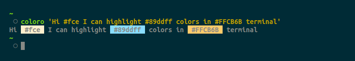
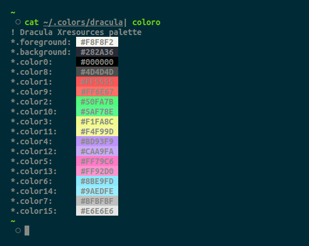
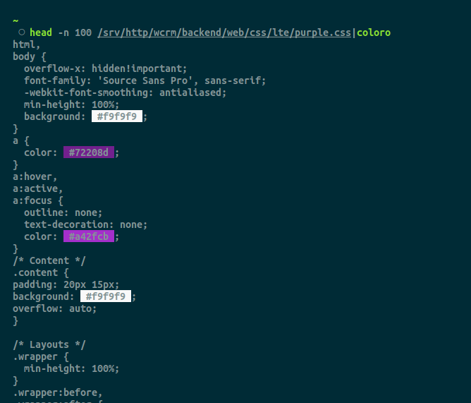
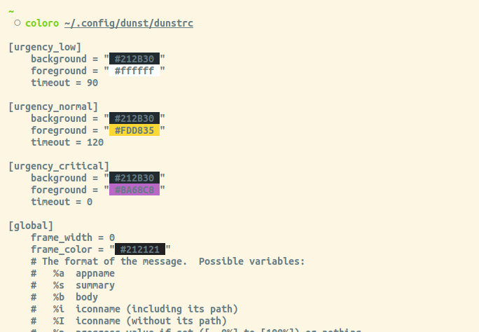

Console Hex Color Highlighter
==================

### Installation

`pip3 install coloro --user`

### Features

 - Output text with highlighted hex colors from string/piped text/clipboard

### Usage Examples

  - `coloro 'some #fff text #c574dd with colors'` Highlight from arg
  
  - `coloro -n 'some ffccff text ef42f0 with colors'` Allow highlights for colors without '#' prefix

  - `coloro -c`  Highlight text from clipboard

  - `coloro /some/file/with/colors.txt` Highlight file

  - `cat /some/file.css | coloro` Highlight from pipe

### Screens

